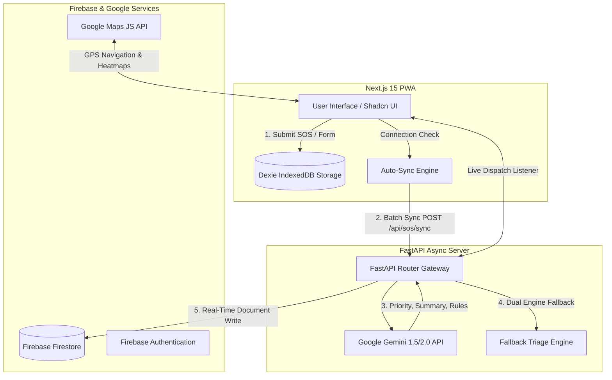

# 🆘 RescueAI — Offline-First AI Disaster Response & Emergency Coordination Platform

> **Hackathon**: IEEE Hack Genesis 2026  
> **Tagline**: Offline-First AI-Powered Disaster Response & Emergency Coordination Platform  
> **Domain**: GovTech & Civic Engagement  

---

## 🌟 Executive Overview

Natural disasters (floods, earthquakes, fires, landslides) collapse communication infrastructure. Emergency helplines (112/911) become overwhelmed, citizens cannot locate safe shelters, and authorities lack real-time priority triage.

**RescueAI** solves this bottleneck with an **Offline-First Progressive Web Architecture**:
- **Offline Persistence**: Citizens can file emergency SOS reports and track GPS coordinates **without internet connectivity**. All incident data persists locally in **Dexie.js (IndexedDB)**.
- **Auto-Synchronization**: When cellular or Wi-Fi connection restores, RescueAI's background engine automatically drains the offline queue and syncs data with **Firebase Firestore**.
- **Gemini AI Triage**: Every emergency payload is processed by **Google Gemini 1.5/2.0 AI** to calculate instant priority levels (`CRITICAL`, `HIGH`, `MEDIUM`, `LOW`), generate executive dispatch summaries, and synthesize step-by-step survival guidance.
- **5-Role Coordination System**: Dedicated command dashboards tailored for **Citizens**, **Rescue Teams**, **Government Authorities**, **Hospitals**, and **NGOs**.

---

## 🏗️ System Architecture



---

## 🚀 Key Features by User Role

### 1. Citizen Portal
- **Emergency SOS Dispatch**: One-tap trigger with satellite GPS lock (`latitude`, `longitude`, `accuracy`).
- **Offline Storage**: Save incident reports when cell towers fail.
- **AI Emergency Assistant**: Interactive Gemini chatbot for flood, fire, and earthquake survival advice.
- **Nearby Shelter Directory**: Live shelter capacity meters, food/medical supply indicators, and direct Google Maps directions.

### 2. Rescue Team & Authority Command Center
- **Live SOS Triage Queue**: Real-time incoming SOS reports sorted by AI priority (`CRITICAL` → `HIGH` → `MEDIUM` → `LOW`).
- **Interactive Heatmap**: Geographical incident density maps for strategic resource deployment.
- **Action Dispatcher**: One-click **"Accept Request"** and **"Mark Resolved"** buttons synced directly to citizens.

### 3. Hospital & NGO Relief Network
- **Hospital Bed Monitor**: Real-time ICU and emergency room bed capacity tracking.
- **NGO Shelter Management**: Distribution tracking for food rations, blankets, and clean drinking water.

---

## 🛠️ Technology Stack

| Layer | Technologies |
| :--- | :--- |
| **Frontend Framework** | Next.js 15 (App Router), React 19, TypeScript |
| **Styling & UI** | Tailwind CSS, Shadcn UI, Framer Motion, Lucide Icons |
| **Offline Persistence** | Dexie.js (HTML5 IndexedDB Wrapper), Service Workers |
| **Backend Engine** | FastAPI (Python 3.11), Uvicorn ASGI |
| **AI Triage Engine** | Google Gemini 1.5/2.0 API + Heuristic Fallback Engine |
| **Cloud & Auth** | Firebase Auth, Cloud Firestore, Firebase Admin SDK |
| **Mapping & GPS** | Google Maps Embed API, HTML5 Geolocation |
| **Deployment** | Vercel (Frontend PWA), Render (FastAPI Backend) |

---

## ⚡ Quick Start Guide

### Prerequisites
- Node.js `v18.0.0+` or `v20.0.0+`
- Python `v3.10+` or `v3.11+`
- npm or yarn

### 1. Frontend Setup (`Next.js 15`)

```bash
# Navigate to frontend folder
cd frontend

# Install dependencies
npm install

# Configure environment variables (.env.local)
NEXT_PUBLIC_FIREBASE_API_KEY=your_firebase_key
NEXT_PUBLIC_FIREBASE_PROJECT_ID=rescue-ai-1
NEXT_PUBLIC_FASTAPI_URL=http://localhost:8000/api

# Launch development server
npm run dev
```
Open `http://localhost:3000` in your browser.

### 2. Backend Setup (`FastAPI`)

```bash
# Navigate to backend folder
cd backend

# Install Python requirements
pip install -r requirements.txt

# Launch FastAPI ASGI Uvicorn server
uvicorn app.main:app --reload --port 8000
```
FastAPI Swagger API docs available at `http://localhost:8000/docs`.

---

## 🏆 Hackathon Judge Evaluation Matrix

- **Societal & GovTech Impact**: Direct solution for communication blackouts during natural disasters.
- **Technical Excellence**: Hybrid offline PWA architecture using IndexedDB + Next.js + FastAPI.
- **AI Integration**: Sub-second Gemini 1.5/2.0 API prompt engineering with dual-engine fallback safety.
- **Production Readiness**: 100% clean Next.js production build (`npm run build` code 0) across all 13 routes.

---

**Built with ❤️ for IEEE Hack Genesis 2026.**
